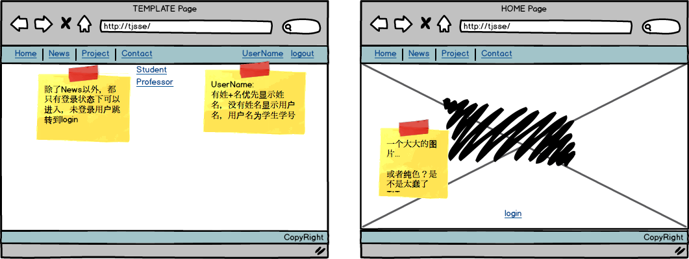
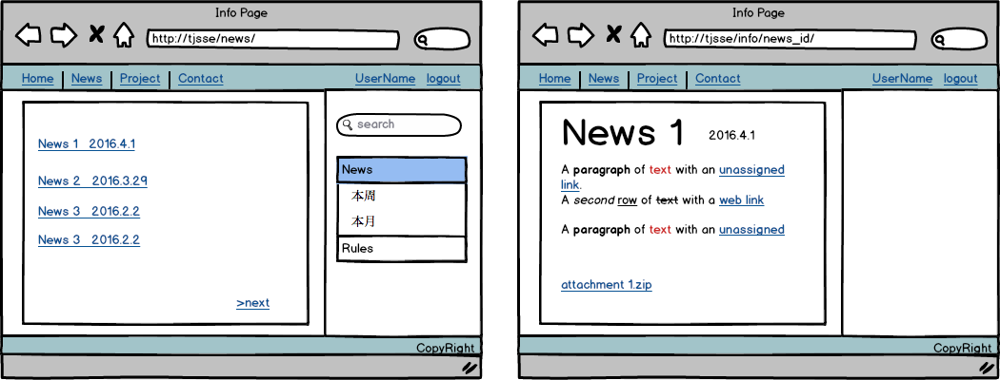
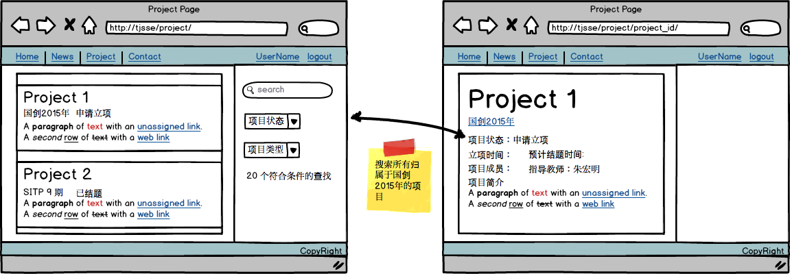
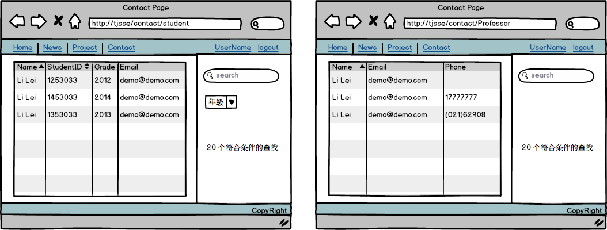
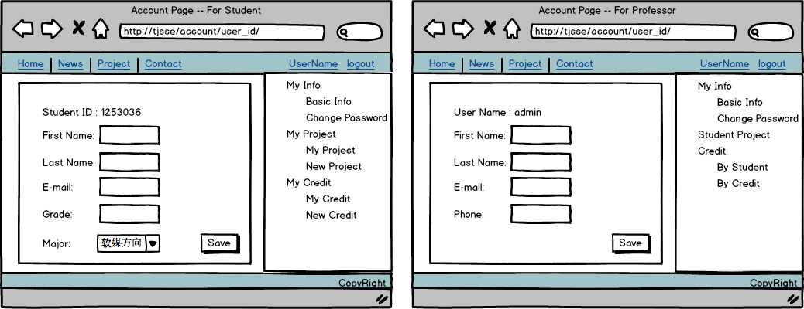
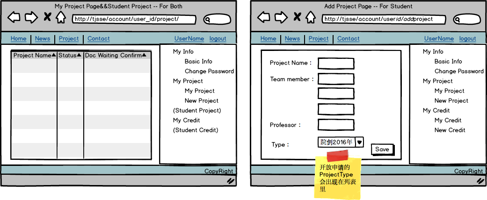
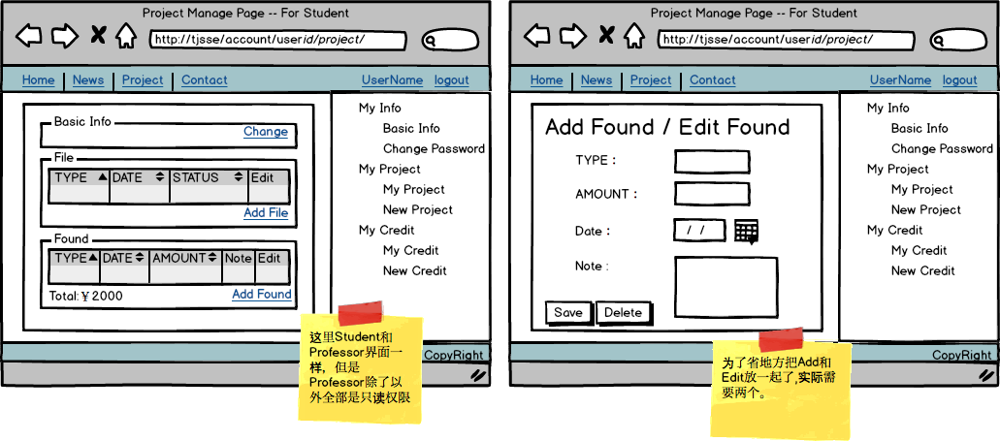
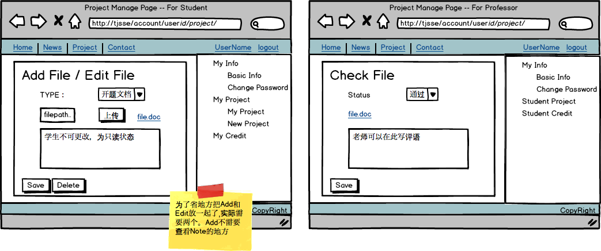
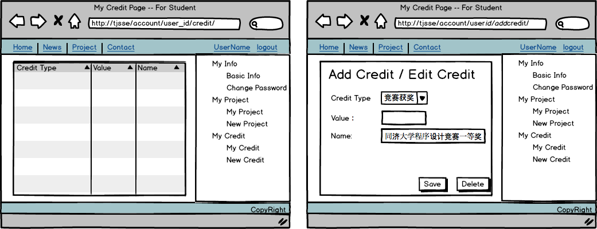
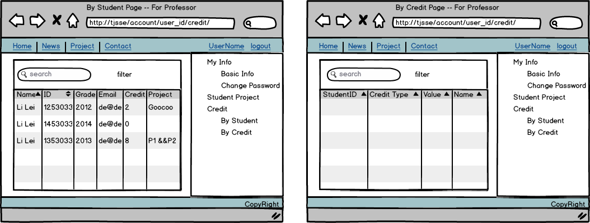

#Demo

##1. template

左图是网站template

Home && News 是可以非登录状态下查看的。 Project&&Contact必须登录状态。没有登录转到login界面，登陆后再转回原页面

登陆后UserName显示名字，没有填写姓名的用户显示UserName（学生的UserName是学号）

##2.主页

见上图右侧。 中间一个大图...下面一个login按钮。

##3. News 页面

左边是列表，分页，每页最多20条，右侧可以按名称查询，添加filter

点进去之后要有文章标题、发布日期、附件下载

##4. Project 页面

Project 列表，分页，每页最多10条，右侧可以按名称/学生ID/指导教师名查询，添加filter (项目状态，项目类型)

Project打开之后，页面里包含所有可以公开的信息

##5.Contact页面

用表格方式呈现即可，可通过姓名，学生ID查找，可以通过年级过滤

##6.Account页面

###6.1 个人信息

左边的是学生的，右边的是老师的。 更改密码二者一样， 需要原密码，新密码&&新密码确认

###6.2 项目管理

####6.2.1项目查看

左边是**学生**或者**指导教师**点开My Project后效果，所有项目罗列。

右边是**学生**新建 New Project

团队成员和指导教师需要验证数据库中是否存在。 Type必须是正在开放的申请类型

####6.2.2项目资金管理

左边是从列表中打开一个project后，**学生**所见如上左图。 **指导教师**所见类似，但是除了file的表格条目可以点进去外，其他都是只读的，没有添加和编辑条目的选项

**学生**点击下面found中的一个条目后面的Edit，进入编辑。 或者Add Found 新建一个资金花费，如上右图。

####6.2.3项目文档管理

**学生**点击file中的一个条目后面的Edit，进入编辑。 或者Add file 新建一个资金花费，如上左图。

**教师**点击file中的一个条目进入编辑，如上右图。教师可以下载查看文档，看是否通过，更改状态为通过或未通过，并在下方留言批注

###6.3学分管理

####6.3.1 学生学分管理

左边是学生自己学分的列表

**学生**点击列表中的一个条目进入编辑。 或者新建一个条目如上右图。

####6.3.1 教师端学分管理

按学生名字查看，可以查看所有学生当前的创新学分综合，以及该生所有的创新项目（创新项目名字是一个link，会link到该项目页面，见4.Project页面）

按学分查看，是所有创新学分认定的条目

需要添加搜索功能和各种filter功能

