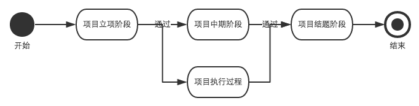

# 需求规约（说明书）
---

##1. 介绍

同济大学为了促进高素质创新性人才的培养，特别是卓越人才培养计划的实施，积极鼓励学生开展创新项目，并给予创新项目和竞赛中获得奖项的学生创新能力与拓展学分和相应的成绩。

总的来看，创新能力与拓展学分的认定分为四类，竞赛获奖、学术论文、获国家发明专利及大学生创新项目。竞赛获奖分为校级、省部级、国家级、国际级及其他行业类学科学科竞赛。学术论文按发表刊物分为权威报纸、核心期刊和被SCI、EI。国家发明专利认定资格包括前三作者。大学生创新项目包括国家级、市级和校级（SITP）等。

这其中，创新项目的申报结题与经费上的报销都需要学校和学院的参与，为此学校和学院需要定期检查和了解创新项目的完成情况。一个完整的创新项目大概分为如下几个阶段：



+ 项目立项阶段：

	1. 学院管理部门在网上发布通知学生进行项目申请
	+ 学生网上填写项目申请书 【项目状态：未申请立项】
	+ 指导教师网上审核申请书(注：指导教师只能看到自己指导的学生的申请书)
	+ 指导教师审核不通过，回到步骤2
	+ 指导教师通过【项目状态：申请立项】
	+ 由学院组织立项申请答辩
	+ 答辩不通过，回到步骤2
	+ 答辩通过，学校统一立项【项目状态：立项通过】
+ 项目中期阶段
	1. 学院管理部门在中期考核前发布通知
	+ 学生需要网上提交中期考核表【项目状态：立项通过】
	+ 指导教师网上审核阶段考核报告
	+ 指导教师审核不通过，回到步骤2
	+ 指导教师通过【项目状态：申请中期】
	+ 由学院组织中期考核答辩
	+ 答辩不通过，回到步骤2
	+ 答辩通过【项目状态：中期通过】
+ 项目结题阶段
	1. 学院管理部门在结题考核前发布通知
	+ 学生需要网上提交结题报告【项目状态：中期通过】
	+ 指导教师网上审核结题报告
	+ 指导教师审核不通过，回到步骤2
	+ 指导教师通过【项目状态：申请结题】
	+ 由学院组织结题答辩
	+ 答辩不通过，回到步骤2
	+ 答辩通过【项目状态：已结题】
+ 项目执行过程（在项目执行过程中，学生可以做出以下申请）
	+ 申请延期
	+ 申请提前结题
	+ 申请更换成员
	+ 申请经费报销

长期以来，软件学院统计和管理学生创新项目和学分认定的申报一直通过纸质版文件，人工整理，费时费力。且没有清楚的记录，无法方便快捷地了解和统计学生创新学分的申报情况。尤其是在跟踪学生创新项目进展状况这一点上，只能翻资料查联系方式询问，十分的不便。


另外学生彼此之间不了解相互的课题，经常出现同一个类型的课题有多组学生申报或者重复做往年已有过的课题的状况，这样不仅不能体现创新精神，也劳民伤财，浪费了宝贵的科研经费.


在这种情况下，设计开发一个能够统计管理学院学生创新项目认定的平台的必要性不言而喻。本课题即在此背景下提出。


##2. 整体描述

###2.1 项目特点、特色

1. 使用B/S架构： 支持跨平台使用，选择B/S结构方便用户随时使用，省去下载客户端的麻烦，支持多系统使用

2. 使用响应式设计: 使用响应式设计，使得在移动平台使用更方便，不需转码

###2.2 运行环境等

硬件配置：

服务宽带：

网络可用宽带：

##3.	主要的功能需求描述

根据实际需求与创新项目认定逻辑，实现一个跨平台的可管理跟踪学生创新项目状态和统计创新学分认定的网页应用。

###3.1 角色
使用用户根据不同角色主要功能如下：

1. 学生
	
	学生是学生科技创新和实践的主体，主要执行功能如下；各级学生创新项目的网上申请和立项流程，项目阶段考核流程，项目中期检查流程，项目执行变更流程，项目结题流程；各类竞赛项目报名，组队，总结等流程；论文，专利网上申报流程；创新学分认定流程；各类科技创新成果填报等。
	
	学生包含本科生（含国内其他高校的交换生），硕士研究生，博士研究生和留学生。其中硕士研究生和博士研究生不能主持项目，但可以参加项目。

+ 指导教师

	指导教师负责包括各级创新项目、各类竞赛、论文、专利的指导和所指导项目的日常流程管理，成果管理等。

+ 学院教务

	能够获得学院学生的创新简历和管理相应创新能力拓展学分、素质与能力拓展课程学分管理等教务工作

+ 	学院管理部门

	创新活动的一线管理部门，能够进行学院各类学生创新活动的组织、审核、查询、统计和日常管理等工作；管理创新能力拓展项目、素质与能力教学环节管理；学生创新简历的管理等。

+ 	系统管理员

	负责系统管理和数据维护

###3.2 模块

系统根据功能主要包括以下几个模块

1.	信息发布模块
	
	信息分为新闻、通知、规章制度等，内容包括文字、图片及附件

	**使用权限：**所有人可以申请填报，学院管理部门进行审批，审批通过所有人员无需登陆均可看到结果。

2.	创新项目管理模块

	**使用权限：**学生、指导教师、学院管理部门	

	**功能要求：**

	+ 学生能够提交项目过程中的相关文档（如开题报告，结题报告等）
	+ 学生能够提交经费使用情况
	+ 指导教师能够对学生提交的文档做出评价
	+ 能够查询项目当前状态（包括处于哪个阶段，已使用多少经费）
	+ 能够查看项目关联的文档
	+ 学院管理部门能统计处于某个状态的项目的数目及清单

3.	申请学分认定模块

	**使用权限：**学生，学院教务
	
	学生能够填报申请认定的项目级别和学分，学院教务能够查询统计
4.	用户管理模块
	

	为了系统的安全性，不开放用户注册功能，学院管理部门可以通过学号批量创建学生账号并设定初始密码。用户可以更改密码及姓名等个人信息。


##4. 非功能需求描述

### 4.1 性能需求

+ 估计用户数1000人，日登录用户数最多为100左右

+ 所有检索搜索能在2s内出结果

### 4.2 系统可靠性

+ 应满足7×24小时可以使用

### 4.3 可扩展性

+ 可实现负载均衡

+ 日后若信息量较大，则系统可相应增加服务器实现扩展。

### 4.4 安全性

+ 不能用明文存储密码，防止密码外泄

### 4.5 易用性

+ 易用性：应考虑用户使用方便性，设计界面时应简洁，易于操作，高效

##5. 其他需求等

+ 项目应在一个月内完成
+ 在完成以上需求的前提下尽可能节约成本
